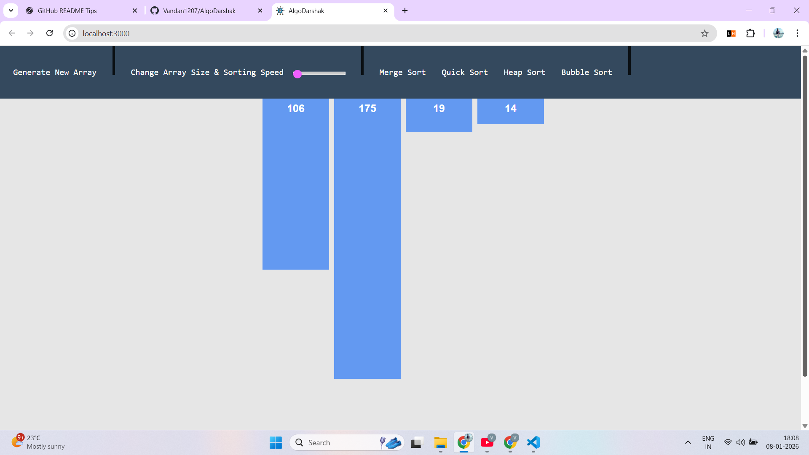
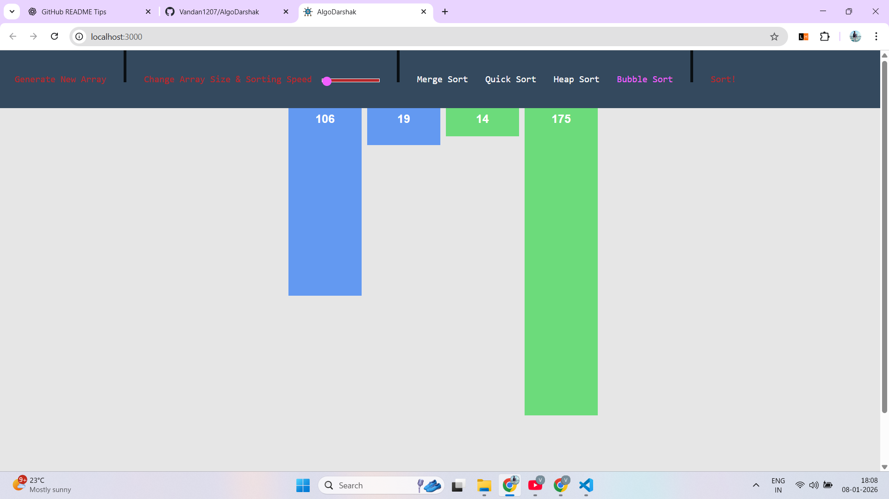

# AlgoDarshak 🚀
<p align="center">
  <a href="https://youtu.be/3_nJKDRT0GE" target="_blank">
    
  </a>
  &nbsp;&nbsp;
  <a href="https://www.youtube.com/watch?v=VIDEO_ID" target="_blank">
    <b>Watch Demo on YouTube</b>
  </a>
</p>
A web app that visually demonstrates how popular sorting algorithms work in real time.
<table align="center">
  <tr>
    <th>Before Sorting</th>
    <th></th>
    <th>After Sorting</th>
  </tr>
  <tr>
    <td align="center">
      
    </td>
    <td align="center" style="font-size:30px;">
      ➡️
    </td>
    <td align="center">
      
    </td>
  </tr>
</table>

## ❓ Why AlgoDarshak?
Understanding sorting algorithms through theory alone can be difficult. AlgoDarshak bridges this gap by visually showing how elements move and get sorted step by step.
## ✨ Key Features
- 📊 Real-time visualization of sorting algorithms  
- 🎚️ Adjustable array size and sorting speed  
- 🔀 Random array generation  
- 🧠 Supports Bubble, Selection, Insertion, Merge & Quick Sort  
## 🧮 Algorithms Implemented
- Bubble Sort  
- Selection Sort  
- Insertion Sort  
- Merge Sort  
- Quick Sort  
## 🛠️ Tech Stack
- **Frontend:** React, Redux, JavaScript, HTML, CSS  
- **State Management:** Redux  
- **Build Tool:** Webpack  
- **Version Control:** Git & GitHub  
## 🚀 Run Locally

```bash
git clone https://github.com/Vandan1207/AlgoDarshak.git
cd AlgoDarshak
npm install
npm start
---
👨‍💻 Developed by **Vandan Thakkar**  
⭐ If you found this project useful, consider giving it a star
